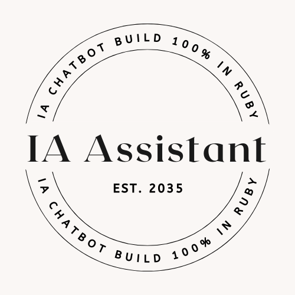

<h1 align="center"> AI Assistant </h1>

<p align="center">
IA Assistant is an AI Assistant created 100% in Ruby using Gemini as the main IA.<br/>
</p>

<p align="center">
  <a href="#-technologies">Technologies</a>&nbsp;&nbsp;&nbsp;|&nbsp;&nbsp;&nbsp;
  <a href="#-deploy">Run Locally</a>&nbsp;&nbsp;&nbsp;&nbsp;&nbsp;&nbsp;
</p>

<p align="center">
  
</p>


## 🚀 Technologies
* Ruby
* Gemini AI
* Capybara
* Selenium
* Webdrivers
* HTTP Requests

## 💻 Run Locally

> To run the project locally you must have `RUBY` on your computer
* Ruby version used: 3.4.1


Steps to run it locally:

1. Clone the Repository

```bash
git clone https://github.com/ssschneider/ruby-ia-chatbot.git
``` 

2. Run bundler to  ensure all gems are installed

```bash
bundle i
```

3. Run the application

```bash
ruby <path>
```

<br/><br/>

---
### Developed by Sarah Schneider 🖖